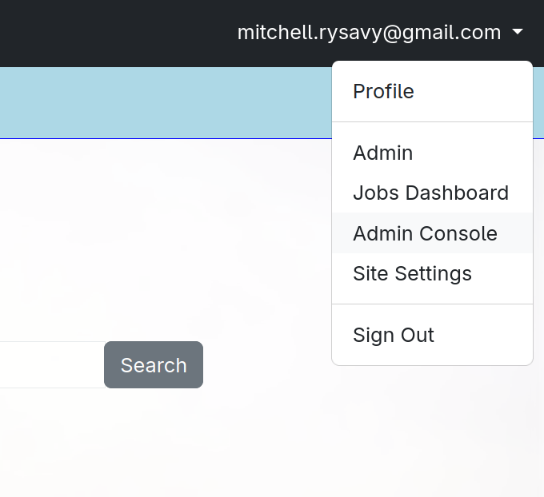
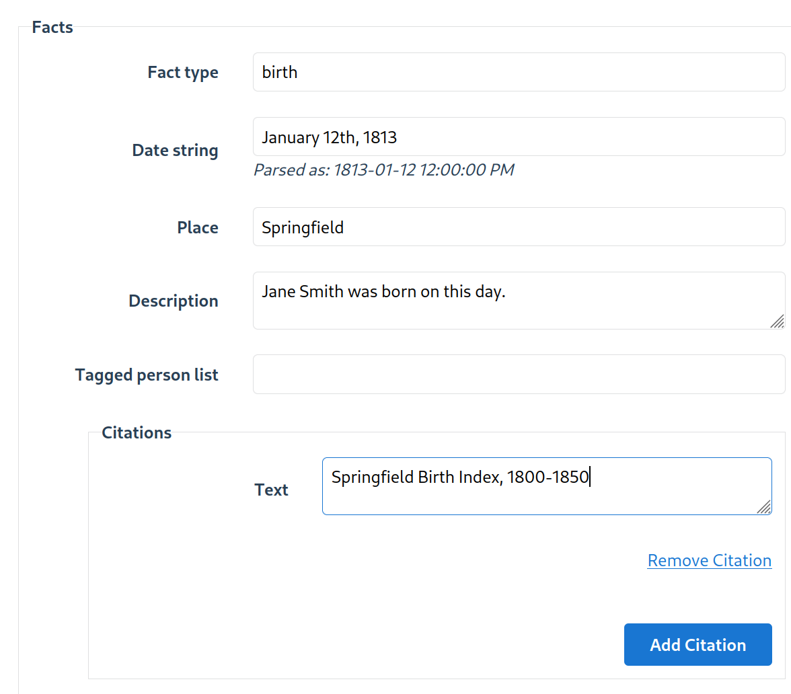

## Creating a New Person

To create a new person, access the administrator interface by clicking the Admin Console option from the dropdown menu.

Then, click the "People" link on the left side of the screen. From here, you can enter details about
the person you want to create.

### Facts

Facts are just what they sound like: facts about a given person or group of people. Some basic facts about people are **Birth**, **Marriage**, **Death**, and **Burial**, but facts can be anything.

Facts can be associated with a single person, when you add them using the Person editor, but they may also tag additional people. For example, for a wedding, you will want to tag the spouse, or perhaps other important guests.

### Citations

Citations are associated with Facts. It is a free-text field and no particular format is expected. It would generally be good practice to be consistent and specific.
